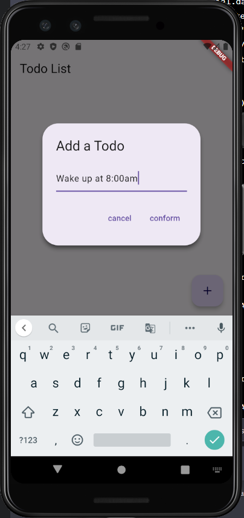
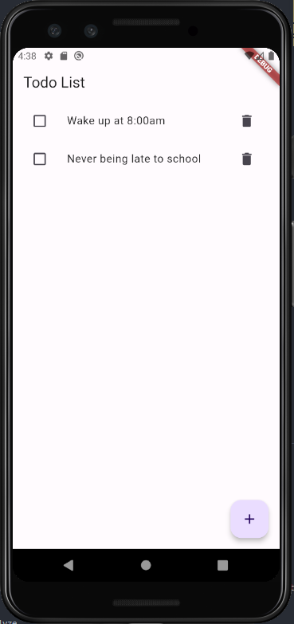

# Todo App

Todo App is a simple Flutter application that allows you to manage your daily tasks. You can add, update, and delete todos in the app, and they will be stored locally using SQLite.

## Features

- View the list of todos.
- Add new todos.
- Mark todos as completed.
- Update todo details(TODO).
- Delete todos.

## Screenshots

  

## Getting Started

Follow these instructions to get the project up and running on your local machine:

1. **Prerequisites**: Make sure you have Flutter installed. If not, follow the [Flutter installation guide](https://flutter.dev/docs/get-started/install) for your operating system.

2. **Clone the repository**: Clone this repository to your local machine using:

   ```
   git clone https://github.com/upple/todo_sample_app.git
   ```

3. **Navigate to the project directory**: Change to the project directory using:

   ```
   cd todo_sample_app
   ```

4. **Install dependencies**: Run the following command to install all the required dependencies:

   ```
   flutter pub get
   ```

5. **Run the app**: Launch the app on your connected device or emulator using:

   ```
   flutter run
   ```

## Technologies Used

- Flutter - A UI toolkit for building natively compiled applications for mobile, web, and desktop from a single codebase.
- SQLite - A lightweight, serverless, self-contained database engine used for local data storage.
- Riverpod - A Reactive Caching and Data-binding Framework.

## Contributing

Contributions are welcome! If you find any bugs or want to add new features, feel free to submit issues or pull requests.

## License

This project is licensed under the MIT License - see the [LICENSE](LICENSE) file for details.

## Acknowledgments

- This app was developed as a part of a Flutter tutorial series.
- Special thanks to the Flutter community for their valuable resources and support.

## Contact

For any inquiries or questions, you can reach me at uppletaste@gmail.com.
